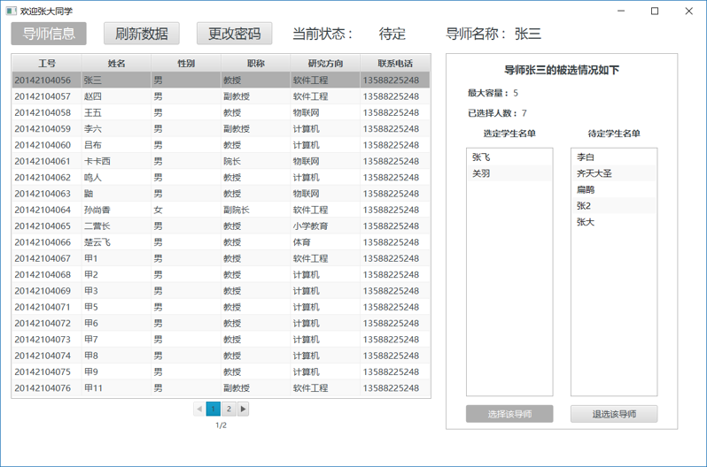
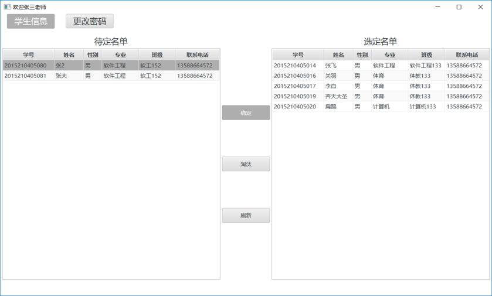
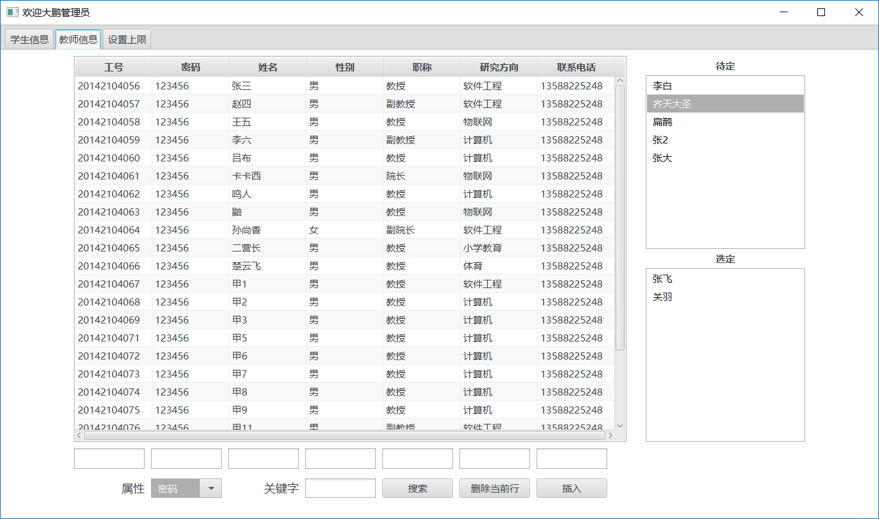
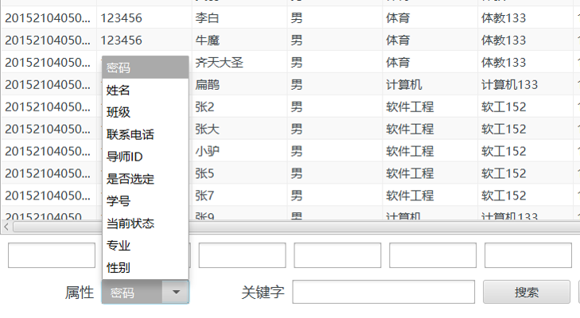

# Java_JavaFX

# 导师学生结对管理系统

 - 使用JavaFx  实现.
 - 分为学生端，导师端，管理员端。
 - 布局使用了FXML，使用了css。
 - 为方便数据库使用，引入了commons-pool ，commons-logging， mysql-connector等包

### 界面

 - 登录
 

 - 学生端
 

 - 教师端
 

 - 管理员-学生端
 

 - 管理员-教师端
 

 - 管理员-多关键字模糊检索
 
